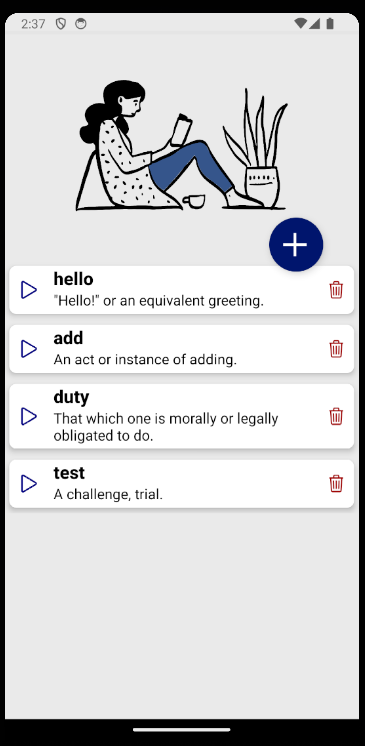

# React Native Practical Course
FlatList; HttpRequests; useEffect 

# Application
- Please, implement a dictionary application that works as follows:  

## Tasks
### App component
should use components AllWords and AddWord. 
- stores added words in the state
- responsible for displaying active screen (can be AllWords or AddWord) 

*Note: for correct tests passing do not import React into App.js*
  
### AllWords component
  
  

 - should be shown at the start of an application
 - receives *switchScreen*, *words* and *setWords* props
   - switchScreen is a function that makes AddWord screen active
   - words is a state value - an array of added words
   - setWords is a state setter for words
 - should use FlatList to display the list of added words
 - if there are no words added, *No words yet* should be on the screen
 - a new word can be added via pressing on "+" pressable element on the screen (Ionicons "add-outline") 
 - each added word should be displayed along with its explanation and two icons Ionicons
   - for playing pronunciation of the word ("play-outline")
     When user presses this icon, playSound function from services/soundHanler should be used tp play the sound. The function is ready, you just need to use it
   - for deletion of the word ("trash-outline")
     When user presses this icon, corresponding word should be removed from the state

### AddWord component
  
  
    
 - is shown after tapping on "+" pressable element on the screen
 - receives *switchScreen* and *setWords* props
   - switchScreen is a function that makes AllWords screen active
   - setWords is a state setter for an array of added words
 - contains input with "type here..." placeholder
 - user can input a word to search and request should be made when 1 second passes after finishing typing. 
   - If there is ongoing request, it should be canceled. 
   - Use getWordInfo function from services/wordsHandler for making requests and retrieving results.
   - If the word is found displays
     - the word itself 
     - icon for playing pronunciation if there is corresponding info (Ionicons "volume-medium-outline")
     - phonetics (if there is corresponding info)
     - part of speech (if there is corresponding info)
     - explanation
     - *Add* button that adds the word to the App's state and turns on AllWords screen
 - user should be able to switch back to AllWords screen by pressing on "back" icon (Ionicons "arrow-back-outline")

### wordHandler service, getWordInfo function
- should use axios to make requests
- use BASE_URL/*word* url to make requests
- transform received information, look into wordHandler.js for details
- getWordInfo shouldn't return a promise that rejects, even if axios request returns a promise that rejects.